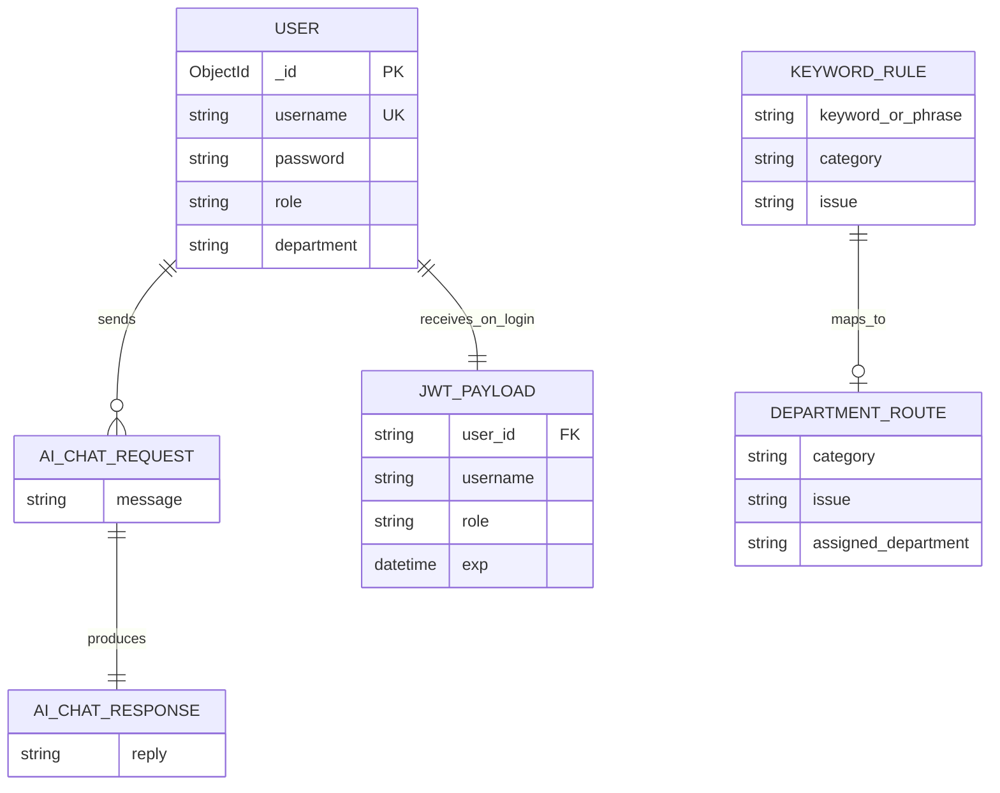

# Meowie CRM — Data Structure Reference (English)

## 1. System overview tree

```
MeowieCRM
├── Persistence
│   ├── MongoDB Atlas
│   │   └── Database: meowie_crm
│   │       └── Collection: users
│   └── Static JSON (local / demo)
│       ├── users.json          (legacy demo users)
│       └── data.json           (placeholder app metadata)
├── Runtime (in-memory, app.py)
│   ├── keyword_one[]           (single-word triggers)
│   ├── keyword_sum[]           (phrase triggers)
│   ├── category_table{}        (category+issue → department)
│   └── dept_names{}            (department display labels)
├── Client storage (browser)
│   └── localStorage
│       ├── token
│       ├── role
│       ├── username
│       └── password            (stored on login — security risk)
└── External services
    ├── OpenAI API              (chat fallback)
    └── Environment (.env)
        ├── JWT_SECRET
        ├── OPENAI_API_KEY
        └── MONGO_URI           (optional)
```

## 2. MongoDB document schema

### Collection: `users`

| Field        | Type     | Required | Notes                                      |
|-------------|----------|----------|--------------------------------------------|
| `_id`       | ObjectId | auto     | Primary key                                |
| `username`  | string   | yes      | Unique login name                          |
| `password`  | string   | yes      | bcrypt hash (UTF-8 decoded string)         |
| `role`      | string   | yes      | `"customer"` \| `"manager"` (default: customer) |
| `department`| string   | no       | Only when `role == "manager"`              |

**Example document:**

```json
{
  "_id": "507f1f77bcf86cd799439011",
  "username": "jane_customer",
  "password": "$2b$12$...bcrypt_hash...",
  "role": "customer"
}
```

```json
{
  "_id": "507f191e810c19729de860ea",
  "username": "bob_manager",
  "password": "$2b$12$...bcrypt_hash...",
  "role": "manager",
  "department": "Logistics"
}
```

## 3. JWT payload structure

Issued on successful `POST /api/login`:

| Claim      | Type   | Description                    |
|-----------|--------|--------------------------------|
| `user_id` | string | MongoDB `_id` as string        |
| `username`| string | Login username                 |
| `role`    | string | `customer` or `manager`        |
| `exp`     | datetime | Expiry (UTC, +24 hours)      |

**Header usage:** `Authorization: Bearer <token>`

## 4. API request / response bodies

### POST `/api/signup`

**Request:**

```json
{
  "username": "string",
  "password": "string",
  "role": "customer | manager",
  "department": "string | null"
}
```

**Response (201):**

```json
{
  "message": "User created successfully",
  "user_id": "string"
}
```

### POST `/api/login`

**Request:**

```json
{
  "username": "string",
  "password": "string"
}
```

**Response (200):**

```json
{
  "message": "Login successful",
  "token": "string (JWT)",
  "role": "customer | manager"
}
```

### POST `/api/ai-chat` (requires JWT)

**Request:**

```json
{
  "message": "string"
}
```

**Response (200):**

```json
{
  "reply": "string"
}
```

**Error (400/401/500):**

```json
{
  "error": "string"
}
```

## 5. Narrow AI knowledge base (in-memory arrays)

### `keyword_one[]` — element shape

```json
{
  "keyword": "string",
  "category": "Logistics | Quality | Finance | IT",
  "issue": "string"
}
```

### `keyword_sum[]` — element shape

```json
{
  "phrase": "string",
  "category": "string",
  "issue": "string"
}
```

### `category_table` — key / value

- **Key:** tuple `(category, issue)`
- **Value:** department name (`Logistics`, `Quality Assurance`, `Finance`, `IT support`, or default `CRM manager`)

## 6. Browser `localStorage` keys

| Key        | Set by        | Purpose                          |
|-----------|---------------|----------------------------------|
| `token`   | login.html    | JWT for API calls                |
| `role`    | login.html    | UI routing (customer vs manager) |
| `username`| login.html    | Display on customer dashboard    |
| `password`| login.html    | Display / demo (not recommended) |

## 7. Entity relationship (logical)



## 8. Role-based navigation tree

```
Login success
├── role = "customer"  →  customer.html  →  /api/ai-chat (narrow AI + OpenAI)
└── role = "manager"   →  index.html     →  dashboard UI + /api/ai-chat
```
